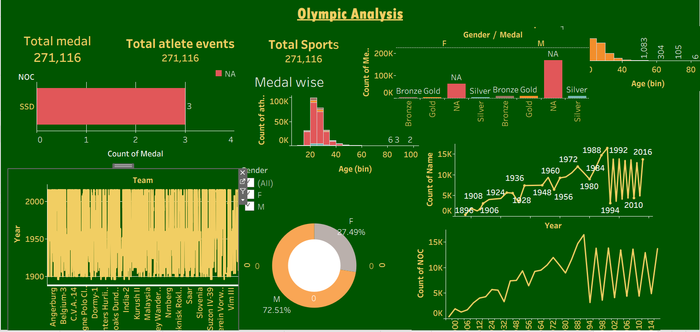

# Olympics Data Analysis Dashboard

## 📊 Project Overview

This project is an interactive **Olympics Data Analysis Dashboard** created using **Tableau**.

The dashboard analyzes Olympic data to identify trends and insights related to athletes, countries, medals, sports, and participation.

## 📊 Dashboard Preview

## 🛠️ Tools & Technologies

* Tableau
* Data Visualization
* Data Analysis
* Excel / CSV Dataset

## 📈 Key Analysis

* Olympic medal distribution
* Country-wise performance
* Athlete participation
* Sport-wise analysis
* Trends across Olympic years
* Interactive filters and visualizations

## 🎯 Objective

The objective of this project is to transform Olympic data into meaningful visual insights and demonstrate practical **data analysis and Tableau dashboard development skills**.

## 📁 Project File

The Tableau packaged workbook is available in this repository:

`olympics project.twbx`

## 👩‍💻 Author

**Kripali**

Aspiring Data Analyst | SQL | Python | Tableau | Machine Learning
